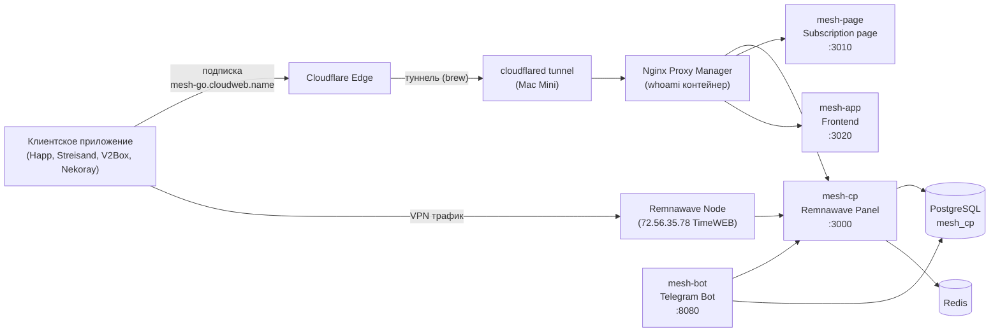
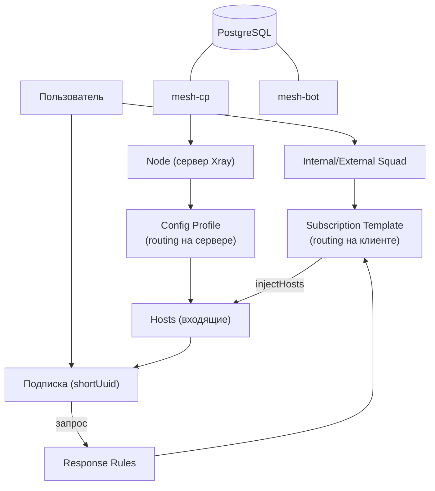

# Архитектура CloudWEB Mesh

## Варианты деплоя

Система существует в двух архитектурах:

| | v1 (Mac Mini, текущий) | v2 (VPS, целевой) |
|---|---|---|
| **Хост** | Mac Mini (локальный Docker) | VPS msk-1-tw-001 (Ubuntu) |
| **Reverse proxy** | Nginx Proxy Manager (NPM) | nginx + envsubst |
| **Сеть** | `cloudweb` | `mesh` |
| **Имена контейнеров** | `mesh-*` | `mesh-*` |
| **БД** | существующий postgres (вне стека) | postgres в стеке |
| **Управление** | Portainer stacks | docker compose CLI |
| **Доступ из интернета** | Cloudflare Tunnel → localhost → NPM | Cloudflare (orange cloud) → VPS IP → nginx |

Подробная спецификация v2 — в `SKILL.md`.

---

## v1 (текущая) — Схема подключения



---

## v1 — Компоненты

### Где что работает

| Компонент | Где | Роль |
|-----------|-----|------|
| **Cloudflare** | Внешний DNS/CDN | Домены, DDoS-защита, прокси |
| **cloudflared tunnel** | Mac Mini (brew) | Соединяет локальные сервисы с Cloudflare |
| **NPM (whoami)** | Mac Mini (Docker) | Reverse proxy, HTTPS, маршрутизация по доменам |
| **mesh-cp** | Mac Mini (Docker) | Remnawave панель (API + админка) |
| **mesh-bot** | Mac Mini (Docker) | Telegram бот управления |
| **mesh-page** | Mac Mini (Docker) | Страница подписки |
| **mesh-app** | Mac Mini (Docker) | Фронтенд панели |
| **PostgreSQL** | Mac Mini (Docker) | Общая БД (mesh_cp, mesh_bot) |
| **Remnawave Nodes** | Удалённые VPS | Xray-серверы, обрабатывают VPN-трафик |

---

## v1 — Домены

| Домен | Назначение | Куда ведёт |
|-------|-----------|------------|
| `mesh-cp.cloudweb.name` | Панель управления | → NPM → mesh-cp:3000 |
| `mesh-go.cloudweb.name` | Подписки | → NPM → mesh-page:3000 |
| `mesh-api.cloudweb.name` | API/webhook | → NPM → mesh-bot:8080 |
| `mesh.cloudweb.name` | Кабинет пользователя | → NPM → mesh-app:80 |

---

## Основные сущности панели (Remnawave)

### Config Profiles (Профили конфигурации)

**Что это:** Полный Xray-конфиг, который определяет как работает нода. Содержит inbounds (входящие порты/протоколы), outbounds (исходящие), routing (маршрутизация на **сервере**).

**Где настраивается:** Панель → Config Profiles

**Пример:** 
- `Default Profile` — inbound VLESS+REALITY на 443, Shadowsocks на 1234
- routing rules: geoip:ru → DIRECT, bittorrent → BLOCK

**Важно:** Routing в Config Profile работает **на стороне сервера (ноды)** — управляет тем, куда трафик идёт с VPS. Не влияет на клиентские подписки.

**Твой серверный routing (Config Profile):**
```
geoip:private → BLOCK
geosite:private → BLOCK  
bittorrent → BLOCK
geoip:ru → DIRECT
geosite:category-ru → DIRECT
всё остальное → выход через DE-ноду
```

### Nodes (Ноды)

**Что это:** Физические/виртуальные сервера с Xray. Каждая нода использует Config Profile.

**Твои ноды:**
- `msk-1-tw-001` (72.56.35.78, TimeWEB) — основная, inbound на 443
- `nyc-1-hm-001` (23.26.0.77, HostMan) — US выход
- `fra-1-hm-002` (213.182.213.214, HostMan) — EU выход

---

### Hosts (Хосты)

**Что это:** Конкретные входящие подключения на ноде. Каждый host = один пользовательский "сервер" в подписке. Содержит адрес, порт, протокол, ключи.

**Пример host:**
- tag: `VLESS-TCP-REALITY`
- address: `msk-1.example.com`
- port: 443
- protocol: vless
- sni: `www.microsoft.com`

**Типы хостов:**
- `HIDDEN` — не показывается в общем списке, но подписка генерируется
- `NOT_HIDDEN` — виден везде

---

### Subscription Templates (Шаблоны подписок)

**Что это:** JSON/YAML конфиг, который клиент получает при запросе подписки. Определяет routing **на стороне клиента** — какие домены через VPN, какие напрямую.

**Типы шаблонов:**
- `XRAY_JSON` — для клиентов на Xray core (Happ, Streisand, Nekoray, V2Box)
- `MIHOMO` — для Clash/Mihomo клиентов
- `SINGBOX` — для Sing-box клиентов
- `STASH` — для Stash клиентов
- `XRAY_BASE64` — fallback для старых клиентов

**Твои XRAY_JSON шаблоны:**

| Шаблон | Для кого | Routing rules |
|--------|----------|---------------|
| **Default** | Все пользователи по умолчанию | geoip:private → direct, geoip:ru → direct, РФ домены → direct, card.club → direct, bittorrent → direct, AI/соцсети → proxy |
| **XRay-One** | Если назначен конкретно | идентичен Default |

**Порядок правил в XRAY_JSON шаблоне (клиентский routing):**

```
1. geoip:private                 → DIRECT (локальные адреса не в VPN)
2. geoip:ru                      → DIRECT (российские IP напрямую)
3. geosite:ru + РФ домены+банки  → DIRECT (российские сайты напрямую)
4. card.club                     → DIRECT (обходит блокировку Cloudflare)
5. bittorrent                    → DIRECT (торренты не через VPN)
6. AI, соцсети, мессенджеры       → PROXY (через VPN-сервер)
7. всё остальное                 → PROXY (по умолчанию через VPN)
```

**Где хранятся:** БД `mesh_cp`, таблица `subscription_templates`, поле `template_json`.

**Seed-файл (источник правды для новых установок):**
```
src/modules/subscription-template/constants/default-templates.ts
```

---

### Internal Squads (Внутренние сквады)

**Что это:** Группы пользователей внутри панели. Позволяют:
- Объединять пользователей в группы
- Назначать группам свои хосты
- Назначать группам свои шаблоны

**Твои сквады:** (перечислить если есть)

### External Squads (Внешние сквады)

**Что это:** Группы пользователей из внешних систем. Позволяют:
- Подключать пользователей из Telegram-бота
- Назначать внешним группам отдельные хосты/шаблоны
- Управлять доступом

---

## Как работает подписка

### Цепочка запроса

```mermaid
flowchart LR
    A["Клиент (Happ)<br/>запрашивает подписку"] -->|"GET https://mesh-go.cloudweb.name/sub/{shortUuid}"| B["Remnawave Panel"]
    B --> C["Определяет тип клиента<br/>(по User-Agent)"]
    C --> D["Применяет Response Rules (SRR)"]
    D --> E["Выбирает Subscription Template"]
    E --> F["Форматирует с данными пользователя<br/>(хосты, трафик, срок)"]
    F --> G["Добавляет заголовки<br/>(profile-title, subscription-userinfo)"]
    G --> H["Возвращает JSON клиенту"]
```



### Что влияет на выбор шаблона

1. **Response Rules (SRR)** — если есть правило, совпадающее с клиентом → берётся указанный шаблон
2. **External Squad пользователя** — если пользователь в squad'е → берётся шаблон squad'а
3. **Default** — если ничего из выше не сработало

### Response Rules (SRR)

**Что это:** JSON-правила, которые определяют какой шаблон отдать какому клиенту. Проверяются сверху вниз, первое совпадение срабатывает.

**Пример:**
```json
{
    "name": "Happ iOS",
    "enabled": true,
    "operator": "AND",
    "conditions": [
        { "headerName": "user-agent", "operator": "CONTAINS", "value": "happ" },
        { "headerName": "x-device-os", "operator": "EQUALS", "value": "ios" }
    ],
    "responseType": "XRAY_JSON",
    "responseModifications": {
        "subscriptionTemplate": "XRay-One"
    }
}
```

**Где хранятся:** БД `mesh_cp`, таблица `subscription_settings`, поле `response_rules`.

---

## Telegram бот (mesh-bot)

### Возможности

| Команда | Описание |
|---------|----------|
| `/start` | Старт, регистрация |
| Мои подписки | Список активных подписок |
| Купить подписку | Оформление новой подписки |
| Продлить | Продление существующей |
| Поддержка | Связь с админом |
| Админ-панель | Управление пользователями, серверами |

### Как бот взаимодействует с панелью

```
Бот (mesh-bot) → API mesh-cp (REST) → Создание/управление пользователями
Бот (mesh-bot) → PostgreSQL (mesh_cp) → Прямые запросы к БД
Бот (mesh-bot) → PostgreSQL (mesh_bot) → Свои данные (сессии, платёжки)
```

### Интеграция

- **Регистрация:** бот создаёт пользователя в панели → выдаёт подписку
- **Платежи:** бот обрабатывает оплату → активирует/продлевает подписку
- **Уведомления:** бот шлёт уведомления об истечении, проблемах
- **Бэкапы:** бот делает ежедневные бэкапы БД

---

## Куда добавлять правила

### Routing на сервере (Config Profile)

**Где:** Панель → Config Profiles → редактировать профиль → routing.rules

**Что делает:** Управляет как Xray на ноде маршрутизирует трафик. Например, РФ-трафик выходит DIRECT с той же ноды, иностранный — через другую ноду.

**Когда менять:** Когда нужно изменить как сервер обрабатывает трафик (например, добавить новую страну для DIRECT).

### Routing на клиенте (Subscription Template)

**Где:** Панель → Templates → XRAY_JSON → Default → routing.rules

**Что делает:** Определяет какие домены/IP на **клиентском устройстве** идут через VPN, а какие напрямую.

**Когда менять:** Когда нужно чтобы сайт шёл с домашнего IP клиента (как card.club), а не с сервера.

**Как менять через БД:** (см. `xray-routing/SKILL.md`)

```sql
UPDATE subscription_templates
SET template_json = jsonb_set(
    template_json,
    '{routing,rules,2,domain}',
    (template_json->'routing'->'rules'->2->'domain') || '["example.com"]'::jsonb
)
WHERE template_type = 'XRAY_JSON';
```

### Routing на клиенте локально (приложение)

**Что делать:** В приложении (Happ, Streisand и т.д.) добавить сайт в Direct/Bypass список.

**Предупреждение:** Не использовать `geosite:ru` в Happ — стандартный geosite.dat не содержит этой секции, Xray упадёт.

---

## Настройки подписок

### Subscription Settings

| Поле | Твоё значение | Описание |
|------|--------------|----------|
| `profile_title` | `Mesh 🗽 CloudWEB` | Название подписки |
| `support_link` | `https://urlme.ru/CloudWEB` | Ссылка поддержки |
| `profile_update_interval` | `12` | Интервал обновления (часов) |
| `serve_json_at_base_subscription` | `false` | Отдавать JSON вместо Base64 |
| `happ_routing` | `NULL` | Не используется (ломает Happ) |

### Subscription Templates

| Поле | Default | XRay-One |
|------|---------|----------|
| `name` | `Default` | `XRay-One` |
| `template_type` | `XRAY_JSON` | `XRAY_JSON` |
| `routing.rules` | 5 правил (см. выше) | идентично Default |
| `outbounds` | direct, block, proxy | идентично Default |

---

## Связи сущностей


